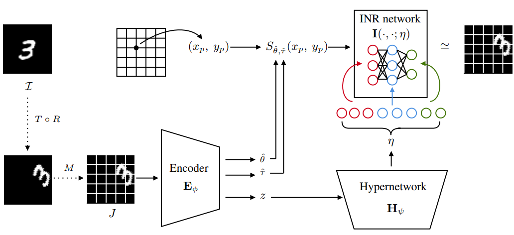
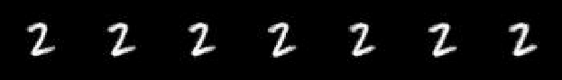
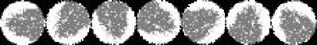
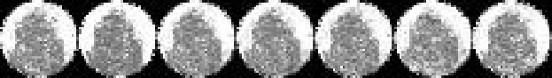
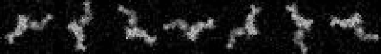
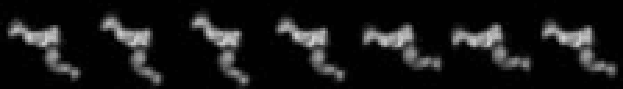
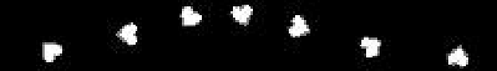

<h1 align="center"><b>IRL-INR</b></h1>
<h3 align="center"><b>Rotation and Translation Invariant Representation Learning <br> with Implicit Neural Representations (ICML 2023)</b></h1>
<p align="center">
</p> 
 
--------------

<br>

This is an repository for **IRL-INR**: [Rotation and Translation **I**nvariant **R**epresentation **L**earning with **I**mplicit **N**eural **R**epresentations](https://arxiv.org/abs/2304.13995). In this work, we propose Invariant Representation Learning with Implicit Neural Representation (IRL-INR), which uses an implicit neural representation (INR) with a hypernetwork to obtain semantic representations disentangled from the orientation of the image. We show that IRL-INR can effectively learn disentangled semantic representations on more complex images compared to those considered in prior works and show that these semantic representations synergize well with SCAN to produce state-of-the-art unsupervised clustering results.
<p align="center">


# **Requirements**
Please check `requirements.txt`.

# **Datasets**
Download dataset.pt on your current directory.
<br>MNIST-U [Downloads]()
<br> WM811k [Downloads]()

# **Instructions: IRL-INR**
Run below descriptions:
```
python train.py ./dataset_configuration/MNIST-U.json
python train.py ./dataset_configuration/wm811k.json
```
Then reconstruction image and checkpoints will be automatically saved in direcotry named: YYYY-MM-DD_HH-MM-SS_DATASET_experiment. 


# **Results**
After training IRL-INR, $J^{\text{(can)}}$ can be reconstructed by simply replacing $(\hat{\theta},\hat{\tau})$ to $(0,0)$. Regardless of rotation and translation, IRL-INR reconstructs consistent image $J^{\text{(can)}}$. 
  |
  |
  |
  |

# **SCAN Clustering**
Encoder of IRL-INR can be utilized for clustering. We faithfully follow the [SCAN source code](https://github.com/wvangansbeke/Unsupervised-Classification). Copy the checkpoint of the encoder to ./SCAN/pretrained_model

## Mining
To save the nearest neighbors, run below:
```
python ./SCAN/mining.py --config_env configs/env.yml --config_exp configs/mining/mining_mnist.yml
```
## SCAN
```
python ./SCAN/scan.py --config_env configs/env.yml --config_exp configs/scan/mnist.yml
```
## Self-labeling
```
python ./SCAN/selflabel.py --config_env configs/env.yml --config_exp configs/selflabel/mnist.yml
```